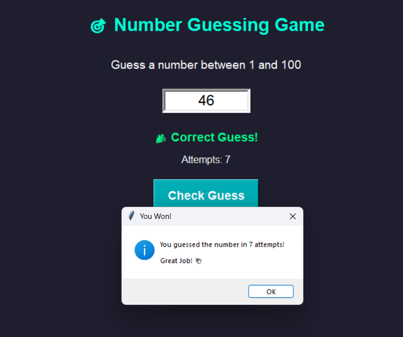

# Number Guessing Game

A simple Python game where the computer randomly selects a number and the player tries to guess it.

## How to play
- Run the program
- Enter your guess
- Get hints (too high / too low)
- Try until you get the correct number

## Features
- Random number generation
- Simple user interaction
- Beginner-friendly Python project

## 📷 Screenshot

## Run

1. Clone the repository:
git clone https://github.com/Core-26/Number-Guessing-Game.git

2. Navigate to the folder:
cd Number-Guessing-Game

3. Run the game:
python your_file_name.py
